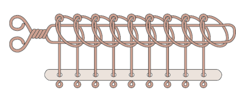
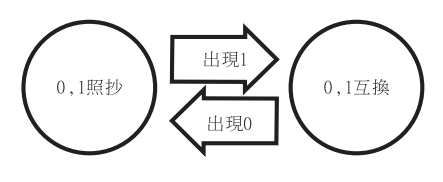

# Table of Contents

- [Table of Contents](#table-of-contents)
- [PA2 X-Linked Rings Puzzle](#pa2-x-linked-rings-puzzle)
- [1. 搞懂九連環](#1-搞懂九連環)
  - [1-1. 數學模型與解法](#1-1-數學模型與解法)
- [2. 寫程式 (No Loop, Only Recursion Accepted)](#2-寫程式-no-loop-only-recursion-accepted)
  - [2-1. 撰寫 Main function 並定義需要的 functions](#2-1-撰寫-main-function-並定義需要的-functions)
    - [Main function](#main-function)
    - [Declaration of functions](#declaration-of-functions)
  - [2-2. 完成需要的 functions](#2-2-完成需要的-functions)
    - [`S_rule()`](#s_rule)
    - [`R_rule()`](#r_rule)
    - [`sovling_rings()`](#sovling_rings)
    - [`finite_automation_function()`](#finite_automation_function)
    - [透過模擬器檢查自己答案是否正確](#透過模擬器檢查自己答案是否正確)
    - [Still Some Problems There](#still-some-problems-there)
- [Bonus](#bonus)
- [Reference](#reference)

# PA2 X-Linked Rings Puzzle

# 1. 搞懂九連環

此處分析與圖片皆出自 [Reference 1](#reference)



## 1-1. 數學模型與解法

- `1` 表示在劍上，`0`表示不在劍上
- 只有符合下列兩條件之一的環才能任意改變狀態:

  - _R_ 會使離劍柄最遠環的狀態更改，舉例: _R_(101011010) = 101011011
  - _S_ 會使劍上最右環的左邊環之狀態更改，舉例: _S_(110110010) = 110110110

- _R_ 或 _S_ 連續運作兩次則會還原回原來的狀態，因此可以得到下列兩項性質

  - _R_ 與 _S_ 皆為 involutions。代表所有九連環狀態 _x_, _R(R(x)) = S(S(x)) = x_
  - 除了 000...000 與 1000...000 不能做 _S_ 的操作外，其餘的狀態都能透操作 _R_ 與 _S_。

- 要解開九連環，就相當於要尋找「一連串 _R_ 或 _S_ 的操作，使得任意初始狀態的九連環得以解開」
- 對於 n 連環的任何狀態只有一個解，而且先做 _R_ 或先做 _S_，只有其中一個能解開。因此若能計算出任意狀態先 _R_ 還是先 _S_，才不會走回頭路解法就完美了。

  - 透過一連串判斷方式，可以寫成一個 Finite Automation 的函數 f:  
    

- 所以對於 n 連環的任意狀態 _x_，完美解法如下:

  - 若 f(x) 為奇數，以 _R_ 作為開頭執行 「R -> S -> R -> ...」解出
  - 若 f(x) 為偶數，以 _S_ 作為開頭執行 「S -> R -> S -> ...」解出

- 對於任意狀態 _x_，必須要 (1/3) \* (2 ^(n + 1) - 2) 步。

# 2. 寫程式 (No Loop, Only Recursion Accepted)

## 2-1. 撰寫 Main function 並定義需要的 functions

我自己習慣先依照要求寫 `main` function，並在認為用 function 處理會比較好的地方寫上要做的事。

### Main function

```cpp
/* Entry point */
int main()
{
    int x = 0;
    int *x_linked_ring = new int[x];
    int *operation_info = new int[2];

    /* Get how many X-Linekd Ring would be solve. */
    cout << "Welcome to play X-Linked Ring!" << endl;
    cout << "How many X-Linked Ring do you want to solve?" << endl;
    cin >> x;
    cout << endl;

    /* Get input state of X-Linked Ring. */
    cout << "What the " << x << "-Linked Ring look like?" << endl;
    cout << "Please enter the rings state from inside to outside." << endl;
    cout << "If the ring is on the sword, please input 1. Otherwise, please enter 0." << endl;
    get_input_state(0, x, x_linked_ring); /* Using recursion function to get user */
    cout << endl;

    /* Print out current state of X-Linked Ring and two rules effects*/
    cout << "The rings state of " << x << "-Linked Ring is: ";
    display_x_linked_ring(x, x_linked_ring);
    cout << "If run R-rule once,the rings state of " << x << "-Linked Ring is : ";
    R_rule(x - 1, x_linked_ring, operation_info);
    display_x_linked_ring(x, x_linked_ring);
    R_rule(x - 1, x_linked_ring, operation_info); // reverse back;
    cout << "If run S-rule once,the rings state of " << x << "-Linked Ring is : ";
    S_rule(x - 1, x_linked_ring, operation_info);
    display_x_linked_ring(x, x_linked_ring);
    S_rule(x - 1, x_linked_ring, operation_info); // reverse back;
    cout << endl;

    /* Solving Rings */
    int total_steps = solving_rings(x, x_linked_ring, operation_info);
    cout << endl;

    /* Finished, print steps to solve and say goodbye.*/
    cout << "The " << x << "-Linked Ring is solved in " << total_steps << " step." << endl;
    cout << "Thanks for using!! Goodbye ~" << endl;

    return 0;
}
```

接著再定義 `main()` 中需要的 functions

### Declaration of functions

```cpp
/* Declaration of functions */
void get_input_state(int x, int *x_linked_ring);                   // Get the input state of X-Linked Ring from user.
void display_x_linked_ring(int x, int *x_linked_ring);             // Display entire X-Linked ring
void S_rule(int end_idx, int *x_linked_ring, int *operation_info); // Doing S-Rule, operation info [idx_turned, turn_up_or_down(1:up, 0:down)]
void R_rule(int end_idx, int *x_linked_ring, int *operation_info); // Doing R-Rule, operation info [idx_turned, turn_up_or_down(1:up, 0:down)]
int solving_rings(int x, int *x_linked_ring, int *operation_info); // Solving X-Linked rings, return total steps to solve.
int finite_automation_function(int x, const int *input);           // returns the last number of input after doing finite automation function for solving X-Linked rings
bool is_solved(int x, int *x_linked_ring);                         // Returns true if X-Linked Rings is solved.
string get_ordinal(int num);                                       // Returns the ordinal string of input number.
int perfect_steps_to_solve(int x);                                 // [unused] Returns the number of minimum steps to solve.
```

## 2-2. 完成需要的 functions

按照上方順序撰寫 functions。  
撰寫過程中可以增加 helper function 以利處理 recursion。使用 function 時也會較為明確，比較不會混淆。

```cpp
/* Declaration of helper functions*/
void get_input_state(int counter, int x, int *x_linked_ring);                                     // helper function for get_input_state()
void display_x_linked_ring(int counter, int x, int *x_linked_ring);                               // helper function for display_x_linked_ring()
int solve_with_a_rule(char rule, int x, int *x_linked_ring, int *operation_info);                 // helper function for solving_rings(). Solve X-Linked Rings with S or R Rule
int finite_automation_function(char mode, int counter, int x, int last_number, const int *input); // helper function for finite_automation_function.
bool is_solved(int counter, int x, int *x_linked_ring);                                           // helper function for is_solved()
```

其中最核心的四個 function 分別為 `S_rule()`、`R_rule()`、`sovling_rings()`、`finite_automation_function()`.

### `S_rule()`

```cpp
/**
 * @brief Doing S-Rule for X-Linked Ring.
 *
 * @param end_idx
 * @param x_linked_ring
 * @return int* x_linked_ring after S-Rule
 */
void S_rule(int end_idx, int *x_linked_ring, int *operation_info)
{
    /* Not found.*/
    if (end_idx == 0)
    {
        return;
    }

    /* Done S_rule and return X-Linked Ring*/
    if (x_linked_ring[end_idx] == 1)
    {
        operation_info[0] = end_idx - 1;

        if (x_linked_ring[end_idx - 1] == 0)
        {
            x_linked_ring[end_idx - 1] = 1;
            operation_info[1] = 1;
        }
        else
        {
            x_linked_ring[end_idx - 1] = 0;
            operation_info[1] = 0;
        }

        return;
    }

    /* Other cases */
    S_rule(end_idx - 1, x_linked_ring, operation_info);
}
```

### `R_rule()`

```cpp
/**
 * @brief Doing R-Rule for X-Linked Ring.
 *
 * @param end_idx
 * @param x_linked_ring
 */
void R_rule(int end_idx, int *x_linked_ring, int *operation_info)
{
    operation_info[0] = end_idx;

    if (x_linked_ring[end_idx] == 0)
    {
        x_linked_ring[end_idx] = 1;
        operation_info[1] = 1;
    }
    else
    {
        x_linked_ring[end_idx] = 0;
        operation_info[1] = 0;
    }
}
```

### `sovling_rings()`

```cpp
/**
 * @brief Sovling X-Linked Rings
 *
 * @param x
 * @param x_linked_ring
 */
int solving_rings(int x, int *x_linked_ring, int *operation_info)
{
    cout << "That start to solve the " << x << "-Linked Ring." << endl;

    char start_rule = '0';
    int counter = 0;

    int last_number_after_automation_function = finite_automation_function(x, x_linked_ring);

    if (last_number_after_automation_function == 0) // even number, start solving steps in S->R->S->...
    {
        cout << "Start with S-rule !!" << endl;
        start_rule = 'S';
        counter = solve_with_a_rule(start_rule, x, x_linked_ring, operation_info);
    }
    else // odd number, start solving steps in R->S->R->...
    {
        cout << "Start with R-rule !!" << endl;
        start_rule = 'R';
        counter = solve_with_a_rule(start_rule, x, x_linked_ring, operation_info);
    }

    return counter;
}

int solve_with_a_rule(char rule, int x, int *x_linked_ring, int *operation_info)
{
    if (is_solved(x, x_linked_ring))
    {
        return 0;
    }

    if (rule == 'S')
    {
        S_rule(x - 1, x_linked_ring, operation_info);
        rule = 'R';
    }
    else
    {
        R_rule(x - 1, x_linked_ring, operation_info);
        rule = 'S';
    }

    string turn = operation_info[1] == 1 ? "up" : "down";

    cout << "!! Turn the " << get_ordinal(operation_info[0] + 1) << " ring " << turn << " !!" << endl;
    cout << "The rings state of " << x << "-Linked Ring is: ";
    display_x_linked_ring(x, x_linked_ring);
    cout << endl;

    return 1 + solve_with_a_rule(rule, x, x_linked_ring, operation_info);
}
```

### `finite_automation_function()`

```cpp
/**
 * @brief Finite Automation function for sovling X-Linked Ring
 *
 * @param input
 * @return int
 */
int finite_automation_function(int x, const int *input)
{

    char mode = 'n'; // n meas normal, s means 0, 1 should be swtich
    int last_number = 0;

    last_number = finite_automation_function(mode, 0, x, last_number, input);

    return last_number;
}

int finite_automation_function(char mode, int counter, int x, int last_number, const int *input)
{
    if (counter == x)
    {
        return last_number;
    }

    int input_num = input[counter];

    if (mode == 'n') // normal mode
    {

        last_number = input_num;

        if (last_number == 1)
        {
            /* Change to be switch mode*/
            mode = 's';
        }
    }
    else // switch mode
    {
        last_number = 1 ? input_num == 0 : 0;

        if (last_number == 0)
        {
            /* Change to be normal mode*/
            mode = 'n';
        }
    }

    return finite_automation_function(mode, counter + 1, x, last_number, input);
}
```

### 透過模擬器檢查自己答案是否正確

[九連環模擬器](http://simonsays-tw.com/web/NineLinkedRings/game/nineLinkedRings.html)

### Still Some Problems There

- `opreation_info` 是否可以不要存在在 main 中? => How to fixed Segmetantion fault if I want to create and return array in a function?

# Bonus

@TODO

# Reference

1. [郭君逸,「九連環與格雷碼」數學傳播 38 卷 3 期, pp. 13-24](https://web.math.sinica.edu.tw/math_media/d383/38302.pdf)
2. [九連環模擬器](http://simonsays-tw.com/web/NineLinkedRings/game/nineLinkedRings.html)
